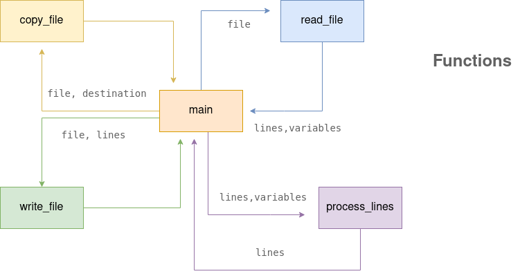

<h1 align="center">deconst-py</h1>

[](https://snapcraft.io/deconst-py)

> Simple **command line tool** for replace constants with their values in **Python files**.

## Basic Algorithm



charts designed with draw.io
## Installation

Currently, **it only works on linux command line. We will support other commonly used operating systems** soon.
### For Linux

Clone project with command
```
git clone https://github.com/M-Enes/deconst-py.git
```

Then, enter the directory with
```
cd deconst-py
```

Then, run this 
```
./deconst.py
```

**Congrats!** You set up deconst-py successfully, you can use it now with `deconst-py` on anywhere.

### For Windows

Coming soon... 💻

## Known Issues

*Currently, doesn't run stable with **multiline variables**.*

*Variable name cannot be defined as **containing another variable name**.*

## Thanks
Thanks [@MaliBYK](https://github.com/MaliBYK) and [@Jandro46t](https://github.com/Jandro46t) my friends that helped me during the development and feedbacks.
